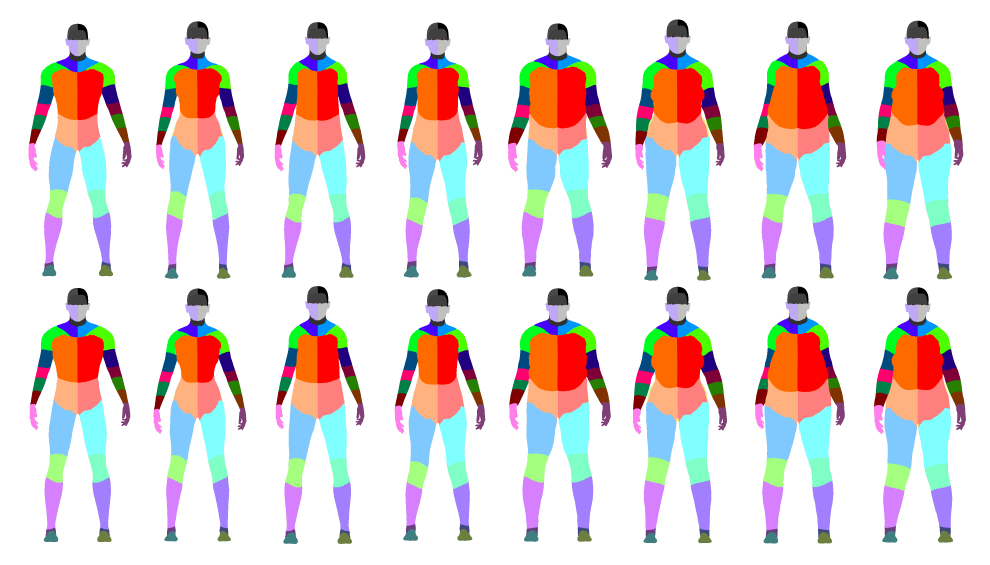
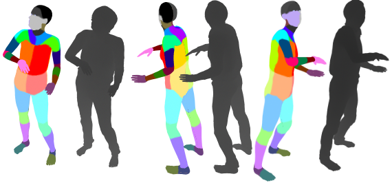

# UBC3V Dataset


UBC3V is a synthetic dataset for training and evaluation of single or multiview depth-based pose estimation techniques.
The nature of the data is similar to the data used in the famous Kinect paper of Shotton et al. [1], but with a few distinctions:

* The dataset distinguishes the back-front and left-right sides of the body.
* The camera location is relatively unconstrained.
* The dataset has three randomly located cameras for each pose, which makes it suitable for multiview pose estimation settings.
* It is freely available to the public.

In Shafaei and Little [2] we show that a convolutional neural network (CNN) trained on this dataset can effortlessly generalize to real-world depth data.

If you've used this dataset, please consider citing the paper:
```bibtex
@inproceedings{Shafaei16,
  author = {Shafaei, Alireza and Little, James J.},
  title = {Real-Time Human Motion Capture with Multiple Depth Cameras},
  booktitle = {Proceedings of the 13th Conference on Computer and Robot Vision},
  year = {2016},
  organization = {Canadian Image Processing and Pattern Recognition Society (CIPPRS)},
  url = {http://www.cs.ubc.ca/~shafaei/homepage/projects/crv16.php}
}
```
If you have any questions, you can reach me at [shafaei.ca](http://shafaei.ca).

## Download Links

* Download UBC3V easy-pose from here (36 GB) [Download](http://www.cs.ubc.ca/~shafaei/homepage/projects/datasets/crv16.dataset.php?easy).
* Download UBC3V inter-pose from here (39 GB) [Download](http://www.cs.ubc.ca/~shafaei/homepage/projects/datasets/crv16.dataset.php?inter).
* Download UBC3V hard-pose from here (14 GB) [Download](http://www.cs.ubc.ca/~shafaei/homepage/projects/datasets/crv16.dataset.php?hard).

SHA256:
```
8de2ebf632709b7fb3a0c11dddd3edc0c2d13416067fc2bc54542b9dd2b52d68  easy-pose.tar.gz
214e070a315e6e5d8d6259ec8a5eff41207de9870f8ce6775e70e6adc5418486  inter-pose.tar.gz
7fb4a4a42c02fb278d0741665a6fe0354ce0387bc84000ff3c2595a282d0776d  hard-pose.tar.gz
```
See the description of these datasets below.

## Sub-datasets
The UBC3V dataset consists of three sub-datasets:

| Subset        | Postures            | #Characters  | Samples |
| ------------- |:-------------------:|:------------:|:-------:|
| easy-pose     | simple (~10k)       | 1            | 1 m     |
| inter-pose    | all (100k)          | 1            | 1.3 m   |
| hard-pose     | all (100k)          | 16           | 300 k   |

The easy-pose, as the name indicates, is an easy sub-problem with a limited set of postures (mostly walking and running) and only one character.
The inter-pose includes all the postures, but with only one character. Finally, hard-pose includes all the postures and the above 16 characters.
The progression in the dataset difficulty is particularly useful for curriculum learning [3] applications. More details on how this data is generated is available in our paper [2].





## Dataset Structure
Each sub-dataset has its own *train*, *valid*, and *test* set, therefore, it is organized into three folders:

* sub-dataset
	* train
	* valid
	* test

Furthermore, each *train*, *valid*, or *test* splits the data into **n** sections (n varies). So the tuple ('easy-pose', 'train', 12), refers to the section *12* of the *train* set of the *easy-pose* dataset. Each section is organized as follows:

* Section i
	* groundtruth.mat
	* images
		* depthRender
			* Cam 1
			* Cam 2
			* Cam 3
		* groundtruth
			* Cam 1
			* Cam 2
			* Cam 3

Each section has a `groundtruth.mat` file that contains the **posture** and the **extrinsic camera parameters** for the images. Note that the intrinsic camera parameters of our dataset is identical to that of `Kinect 2` depth camera.
If you don't care about the multiview feature of this dataset, you can just treat each camera as independent samples.

In the next section we show how you can use this toolkit to:

* Easily access the data.
* Generate point cloud from the depth image.
* Use the extrinsic camera parameters to merge the generated point clouds from different viewpoints.
* Draw the posture in the reference coordinate space.
* Generate a groundtruth class image to feed to a CNN.

## UBC3V Toolkit
The Matlab toolkit for UBC 3 View Dataset facilitates data access and use in Matlab. Grab a copy of this project and navigate to the root folder in Matlab.
Run `init` to initialize the script.

### UBC3V Configuration
The `config.m` script contains the parameters that you need to set before you can use UBC3V Toolkit.

1. `easy_pose_path` must be set to the root folder of the *easy-pose* dataset.
2. `inter_pose_path` must be set to the root folder of the *inter-pose* dataset.
3. `hard_pose_path` must be set to the root folder of the *hard-pose* dataset.

Don't forget to add the trailing `/` in the paths. Now you're ready to use the toolkit.

### Demo
The script `demo_render.m` is a good starting point to learn to use the toolkit. This script reads a sample from the *easy-pose* dataset and visualizes the merged colored point-cloud. The output figures should look like this:


### Useful functions
use the `load_multicam` function to load samples. For exmaple

```matlab
instances = load_multicam('easy-pose', 'train', 150, 1:10);
```

returns an array `instances` from the section 150 of the *train* set in `easy-pose`. The fourth parameter is optional and indicates the indices of the samples to load from that section. If you don't need all the samples in the section this gives you a speed up. Each instance is a Matlab structure with the following data

* instance
	* Cam1
		* translation
		* rotation
		* depth_image
		* class_image
	* Cam2
		* translation
		* rotation
		* depth_image
		* class_image
	* Cam3
		* translation
		* rotation
		* depth_image
		* class_image
	* posture

You can visualize the instances like this
```matlab
figure(1);
% Show the depth images.
subplot(2, 3, 1); imagesc(instance.Cam1.depth_image.cdata); colormap(gray);
subplot(2, 3, 2); imagesc(instance.Cam2.depth_image.cdata); colormap(gray);
subplot(2, 3, 3); imagesc(instance.Cam3.depth_image.cdata); colormap(gray);
% Show the groundtruth images.
subplot(2, 3, 4); imshow(instance.Cam1.class_image.cdata);
subplot(2, 3, 5); imshow(instance.Cam2.class_image.cdata);
subplot(2, 3, 6); imshow(instance.Cam3.class_image.cdata);
```
___
In order to generate the point-cloud we need the depth-map table from a `Kinect 2` sensor. This toolkit contains a copy of this table in the file `/metadata/mapper.mat`. Let's load the `mapper` because we will need it in the following exmaples.

```matlab
map_file = load('mapper.mat');
mapper = map_file.mapper;
clear map_file;
```

use `generate_cloud_camera` to generate a point cloud from a camera.
```matlab
[ cloud, labels, full_cloud, full_colors, mask ] = generate_cloud_camera( instance.Cam1, mapper );
```
* `cloud` is a *N x 3* list of (x, y, z), the particles of our point-cloud.
* `labels` is a *N x 1* list of the corresponding labels (groundtruth).
* `full_cloud` is a *M x 3* unmasked list of (x, y, z). (*M=512x424*)
* `full_colors` is a *M x 1* unamsked list of the labels (groundtruth).
* `mask` is a *512 x 424* logical matrix indicating the mask of the person.

The returned cloud is in the reference coordinate space, meaning that you can merge the point clouds by concatenation of the `cloud` matrices.

use `convert_to_zdepth` to convert the 8-bit input depth image to actual depth values. The output unit is *cm*.

```matlab
zdepth = convert_to_zdepth(camera.depth_image.cdata);
```

use `get_classes_from_image` to get the class indices from the colorful groundtruth.

```matlab
[classes, labels_full] = get_classes_from_image(camera.class_image);
```

`classes` has a list of pixels for each class. `labels_full` is a dense 424x512 matrix with class indices. You can use `labels_full` to train a CNN.

use `get_pose` to get the posture from an instance.

```matlab
pose = get_pose(instance);
```

Each pose has a list of **joint names** and **joint coordinates**.

You can then use `draw_pose` to draw the bones in the current figure.

```matlab
draw_pose(pose);
```
## Camera Parameters
The point cloud generated with this library uses the Kinect-2 intrinsic parameters (as opposed to the actual intrinsic parameters of rendering). Depending on your task, the actual rendering intrinsic parameters may or may not be useful.
According to [@floe](https://github.com/OpenKinect/libfreenect2/issues/41), two Kinect 2s had the below intrinsic parameters.
```
Kinect 2 number 1
depth camera intrinsic parameters:
fx 368.096588, fy 368.096588, cx 261.696594, cy 202.522202
depth camera radial distortion coeffs:
k1 0.084061, k2 -0.271582, p1 0.000000, p2 0.000000, k3 0.101907

Kinect 2 number 2
depth camera intrinsic parameters:
fx 365.402802, fy 365.402802, cx 260.925507, cy 205.594604
depth camera radial distortion coeffs:
k1 0.095575, k2 -0.277055, p1 0.000000, p2 0.000000, k3 0.097539
```

These are the camera parameters that I provided to Maya
```python
   # preview, production
    render_quality = 'production'
    # These numbers are set based on Kinect 2
    near_clip_plane = 50
    far_clip_plane = 800
    focal_length = 25.422
    render_resolution = {'width':512, 'height':424}
    render_resolution['deviceAspectRatio'] = render_resolution['width']/float(render_resolution['height'])
```
As a result, in the maya project file you'll get (for camera 1)
```
createNode lookAt -n "Cam1_group";
	rename -uid "E01E7C8E-4263-5ADD-7B3D-0A929708A22D";
	setAttr ".a" -type "double3" 0 0 -1 ;
createNode transform -n "Cam1" -p "Cam1_group";
	rename -uid "144391DA-46D7-136E-B1B9-228A5D64F3D8";
	setAttr ".v" no;
createNode camera -n "Cam1Shape" -p "Cam1";
	rename -uid "BFD06DE8-4C36-31CA-A8BD-AEAE158811A1";
	setAttr -k off ".v" no;
	setAttr ".fl" 25.422;
	setAttr ".ncp" 50;
	setAttr ".fcp" 800;
	setAttr ".coi" 206.60501080650255;
	setAttr ".imn" -type "string" "persp";
	setAttr ".den" -type "string" "persp_depth";
	setAttr ".man" -type "string" "persp_mask";
	setAttr ".hc" -type "string" "viewSet -p %camera";
	setAttr ".bfc" no;
createNode transform -n "Cam1_aim" -p "Cam1_group";
	rename -uid "10BF624D-4983-D95A-6CCA-35A8E841F33A";
	setAttr ".t" -type "double3" 1.7763568394002505e-014 -1.4210854715202004e-014 -7.1054273576010019e-015 ;
	setAttr ".drp" yes;
createNode locator -n "Cam1_aimShape" -p "Cam1_aim";
	rename -uid "94271F87-4A76-4FBC-C7DE-049A1996478B";
	setAttr -k off ".v" no;
```
If still not helpful, you can download this sample Maya project. [Here!](http://cs.ubc.ca/~shafaei/dataset/mayaProject.zip). Open the project in Maya and check the intrinsic parameters. From what I recall, the camera view calculates and shows every possible parameter you'd hope to see. (Maybe Blender can import/open the Maya files too).
_There are multiple cameras defined by default, make sure you check the parameters of `cam1`,`cam2`, and `cam3`._ 

## Model Files
Are you looking for the fbx models that I used to generate this data? Download it from [here!](http://www.cs.ubc.ca/~shafaei/dataset/3dmodels.tar.gz). The models are generated using the [MakeHuman](http://www.makehuman.org/) project, with CMU conforming skeletons and a specially designed body texture, which can also be found in the above file. The texture is used to generate the groundtruth.

## References
1. Shotton, Jamie, et al. "Real-time human pose recognition in parts from single depth images". Communications of the ACM 56.1 (2013): 116-124.
2. Shafaei, Alireza, Little, James J.. "Real-Time Human Motion Capture with Multiple Depth Cameras". 13th Conference on Computer and Robot Vision, 2016.
3. Bengio, Yoshua, et al. "Curriculum learning." Proceedings of the 26th annual international conference on machine learning. ACM, 2009.
